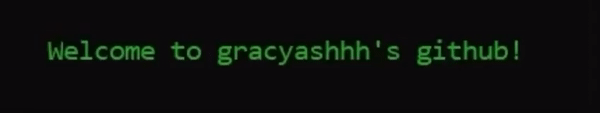

## Hello World    
<!--  -->

### 💻 &nbsp;About Me 
- 🤔 &nbsp; Exploring new technologies and developing software solutions to our worlds tech problems.
- 🔭 I’m currently working on ***Data Analysis and Visualization*** 
- 🌱 I’m currently learning Java with **Data Structures and Algorithms**
- ⚡ Fun fact: I spend more time automating things than actually doing it manually!
- 💬 Ask me about Automation, Competitive Programming & Desktop Application Development🤩
- 🎯 2021 Goal: Mastering DSA and Complete Full stack Development
- 😄 Pronouns: She/Her
- And When I'm not coding, you can probably find me doing one of these: speaking on podcast, writing poems, painting, learning a new skill or a yummy recipe :D

<h3><i>Spare some time to take a look at my <a href="http://aishgrace.me/">Portfolio</a>! and maybe my <a href="https://drive.google.com/file/d/1i6nHOzHCNDVmyM4p_AWSPmZmKAuR1e9r/view?usp=sharing">Resume</a> too :D</i></h3>

### 🛠 &nbsp;My Tech Toolbox 🧰 

 <h3 align="center">
  🧩 Programming Languages
  </h3>

  

 

<h3 align="center">
  👩🏻‍💻 I've worked with
</h3>

  
  
  

  
  
  
   
 
  
  

  
  
  
  
  
  
  

 
  <h3 align="center">
   🌐 Web Dev
  </h3>
  

 
 
 
 
  

  <h3 align="center">
   ⚙️ Tools I use
  </h3>
  

   
  
   
   
  
  

 
  <h3 align="center">
   💾 Backup Tools
  </h3>
  

 
 
 

  

  

 
## 📈 &nbsp;My Stats

 

---

  

  

  <i>Let's connect! Find me on...</i>
    

  
   

  

<a href="https://www.linkedin.com/in/aishwarya-murugappan/">
  <code></code>
</a>
<a href="mailto:gracyashhh@gmail.com">
<code></code>
</a>

  

     Show some  ❤️  by starring some of the repositories!
  
   
    

  
  
  
 

 

